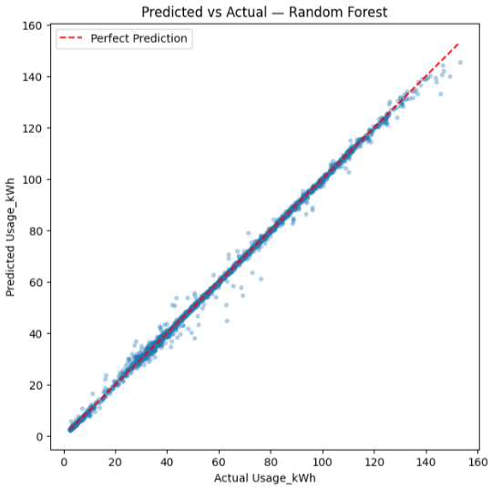

# ⚡ Steel Industry Energy Consumption Analysis & Baseline Regression Modeling

## 📖 Project Overview

This project was completed as part of the **ITSimplera AI/ML Internship**. The objective was to analyze an industrial energy consumption dataset, engineer meaningful features, and build baseline machine learning regression models to predict electricity usage (`Usage_kWh`).

The project is divided into two main parts:

- **Part 1:** Deep Exploratory Data Analysis (EDA) & Feature Engineering
- **Part 2:** Baseline Regression Modeling

The final engineered dataset is used to train and evaluate multiple regression models for predicting energy consumption.

---

## 📂 Repository Structure

```
├── data/
│   ├── Steel_Industry_Energy.xlsx
│   └── engineered_energy_dataset.csv
│
├── week2_eda.ipynb
├── week2_baseline_models.ipynb
│
├── screenshots/
│   ├── dataset_overview.png
│   ├── correlation_heatmap.png
│   ├── boxplot.png
│   ├── avg_energy_usage.png
│   ├── evaluation_metrics.png
│   ├── rmse_comparison.png
│   ├── crossval_results.png
│   └── predicted_vs_actual.png
│
├── requirements.txt
└── README.md
```

---

## 📊 Dataset Information

**Dataset:** Steel Industry Energy Consumption
**Source:** [UCI Machine Learning Repository](https://archive.ics.uci.edu/static/public/851/steel+industry+energy+consumption.zip)
**Size:** 35,040 rows × 11 original columns 

The dataset contains electricity consumption records collected from an industrial steel manufacturing process.

### Original Features

| Column | Description |
|---|---|
| `date` | Timestamp of the reading (15-min intervals) |
| `Usage_kWh` | Energy consumption **(Target Variable)** |
| `Lagging_Current_Reactive.Power_kVarh` | Lagging reactive power |
| `Leading_Current_Reactive_Power_kVarh` | Leading reactive power |
| `CO2(tCO2)` | CO2 emissions |
| `Lagging_Current_Power_Factor` | Lagging power factor |
| `Leading_Current_Power_Factor` | Leading power factor |
| `NSM` | Number of seconds from midnight |
| `WeekStatus` | Weekday / Weekend |
| `Day_of_week` | Day name |
| `Load_Type` | Light / Medium / Maximum Load |

---

## 📥 Dataset Download

The dataset is available through the following link:

**Google Drive:** *https://docs.google.com/spreadsheets/d/1NyC750ZBipJyxifVBqoJJso8MJFEWf0X/edit?usp=drive_link*

After downloading:

1. Create a folder named `data/` inside the project directory.
2. Place the downloaded dataset inside the `data/` folder.
3. Run the notebooks in order: `week2_eda.ipynb` first, then `week2_baseline_models.ipynb`.

---

## ⚙️ Environment Setup

**Clone the repository**
```bash
git clone https://github.com/Kashaf537/Steel-Industry-Energy-Consumption.git
```

**Navigate into the project**
```bash
cd Steel-Industry-Energy-Consumption
```

**Install dependencies**
```bash
pip install -r requirements.txt
```

**Launch Jupyter Notebook**
```bash
jupyter notebook
```

---

## 🛠️ Feature Engineering

### Critical Fix: Date Column Format Bug

Before any feature engineering could be trusted, a significant data quality issue 
was uncovered in the `date` column. About a third of the rows (11,520 out of 
35,040) had been stored by Excel as native datetime values with the **day and 
month accidentally swapped**, whenever the day was ambiguous (≤ 12 — a number 
that could also pass as a month). The remaining rows were stored correctly as 
plain text.

This was detected by comparing a derived day-of-week/weekend status against the 
dataset's existing `Day_of_week` and `WeekStatus` columns, which revealed 
thousands of mismatches. The root cause was traced, the `date` column was 
corrected, and the fix was verified — resulting in **zero mismatches** across 
all 35,040 rows. This step was essential, since every time-based feature below 
depends on `date` being accurate.

### Engineered Features

| Feature | Description |
|---|---|
| `Hour` | Hour of day, extracted from the corrected `date` column |
| `Month` | Month, extracted from the corrected `date` column |
| `Day_of_week` / `WeekStatus` | Validated against the dataset's original columns (see above); duplicates dropped, originals retained |
| `PowerFactorRatio` | `Leading_Current_Power_Factor` ÷ `Lagging_Current_Power_Factor` |
| `HighLoad` | Binary feature — 1 if `Usage_kWh` is above the 75th percentile, else 0 |

The original `date` column and target-leakage features (`HighLoad`, `CO2(tCO2)`) 
were removed before model training (see *Data Preprocessing* below).

---

## 📈 Exploratory Data Analysis (EDA)

The following analyses were performed:

- Dataset structure overview
- Date column data quality audit (see fix above)
- Missing value and duplicate record checks
- Summary statistics
- Outlier detection in `Usage_kWh` using the IQR method, visualized with a boxplot
- Correlation heatmap of all numerical features
- Average energy consumption by `Load_Type` (grouped bar chart)
- Average energy usage by hour of day (line chart)

### Key Findings

- **No missing values or duplicate records** were found in the raw data.
- **A hidden date-parsing bug** affected 33% of rows and would have silently 
  corrupted all time-based features if left unfixed (see above).
- **328 outliers** were detected in `Usage_kWh` using the IQR method — retained, 
  as they likely reflect genuine peak production periods rather than data errors.
- **Top correlated features with `Usage_kWh`:** `CO2(tCO2)` (0.988), 
  `Lagging_Current_Reactive.Power_kVarh` (0.896), and `Lagging_Current_Power_Factor` 
  (0.386).
- **`CO2(tCO2)`'s near-perfect correlation (0.988)** strongly suggests it is a 
  scaled derivative of `Usage_kWh` rather than an independently measured feature 
  — a leakage risk that was addressed during model preprocessing.
- **Energy usage varies clearly by `Load_Type` and hour of day:** Maximum Load 
  periods consume substantially more energy than Medium or Light Load, and usage 
  peaks sharply during standard operating hours before dropping overnight — 
  suggesting energy spikes are primarily driven by production scheduling and 
  machinery running at full capacity.

---

## 🤖 Baseline Regression Modeling

Four regression models were trained:

- Linear Regression
- Ridge Regression
- Decision Tree Regressor
- Random Forest Regressor

### Data Preprocessing

- Dropped the `date` column and target-leakage features: `HighLoad` (directly 
  derived from `Usage_kWh`) and `CO2(tCO2)` (near-perfect correlation with the 
  target, indicating it's likely a scaled derivative rather than an independent 
  signal).
- Applied **one-hot encoding** to categorical variables (`Load_Type`, 
  `Day_of_week`, `WeekStatus`, `Month`), chosen over label encoding since these 
  are nominal categories with no inherent order.
- Handled missing/infinite values in `PowerFactorRatio` (caused by division by 
  zero) using median imputation.
- Performed an 80/20 train-test split with `random_state=42` for reproducibility.

---

## 📏 Evaluation Metrics

Each model was evaluated on the test set using:

- Mean Absolute Error (MAE)
- Root Mean Squared Error (RMSE)
- R² Score

Additionally, **5-fold cross-validation** was performed for each model, reporting 
the mean cross-validation RMSE to assess consistency and generalization beyond a 
single train/test split.

---

## 📊 Results

| Model | Test MAE | Test RMSE | Test R² | CV RMSE (mean) |
|---|---|---|---|---|
| Linear Regression | *fill in* | *fill in* | *fill in* | *fill in* |
| Ridge Regression | *fill in* | *fill in* | *fill in* | *fill in* |
| Decision Tree | *fill in* | *fill in* | *fill in* | *fill in* |
| Random Forest | *fill in* | *fill in* | *fill in* | *fill in* |

The notebook includes:

- RMSE comparison bar chart across all 4 models
- Predicted vs Actual scatter plot for the best-performing model
- Cross-validation results table
- A written Model Selection section explaining the best model, signs of 
  overfitting, and which model is carried forward as the baseline

The best-performing model was selected based on the lowest test RMSE and highest 
R² score, with cross-validation results used to confirm generalization and rule 
out overfitting.

---

## 📷 Screenshots

## Dataset Overview


## Correlation Heatmap


## Box Plot — Outlier Detection


## Average Energy Usage by Hour


## Evaluation Metrics for All Models


## RMSE Comparison


## Cross Validation Results


## Predicted vs Actual Plot



---

## 📌 Conclusions

This project demonstrates the complete workflow of a machine learning regression 
problem, including:

- Data understanding and data quality auditing
- Data preprocessing and leakage prevention
- Feature engineering
- Exploratory data analysis
- Baseline regression modeling
- Model evaluation
- Model selection

Beyond the modeling pipeline itself, this project highlighted the importance of 
validating raw data before trusting it — the date-parsing bug found in Part 1 
would have silently corrupted a third of all time-based features and downstream 
model inputs if it hadn't been caught early. The project establishes a strong, 
well-validated baseline for future work involving hyperparameter tuning, feature 
selection, and more advanced machine learning techniques.

---

## 🧰 Technologies Used

- Python
- Pandas
- NumPy
- Matplotlib
- Seaborn
- Scikit-learn
- Jupyter Notebook

---

## 📄 Requirements

Install all required packages using:

```bash
pip install -r requirements.txt
```

---

## 👨‍💻 Author

**Kashaf Fayyaz**
GitHub: https://github.com/Kashaf537

---

## ⭐ Acknowledgement

This project was completed as part of the **ITSimplera AI/ML Internship**, 
focusing on practical applications of Exploratory Data Analysis, Feature 
Engineering, and Machine Learning Regression.